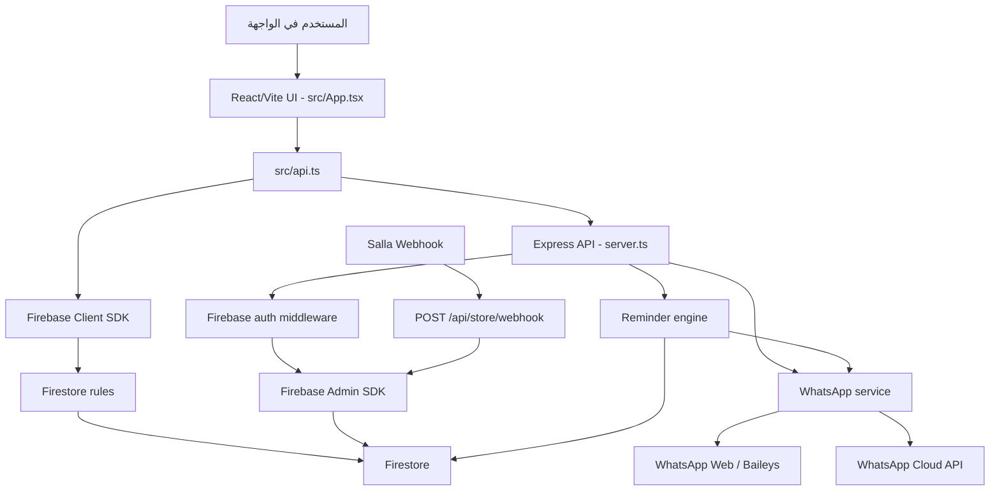
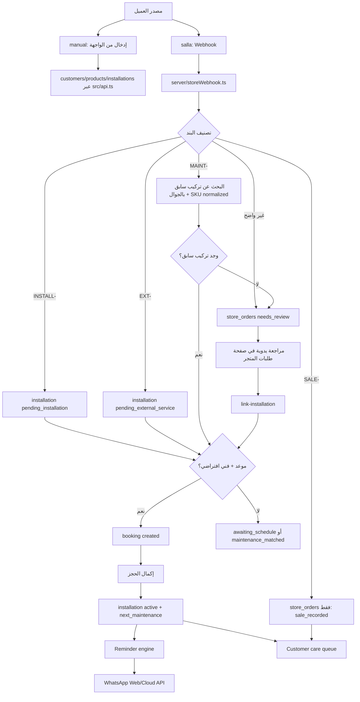

# Golden Pro CRM Architecture and Development Guide

هذا الملف هو خريطة العمل الأساسية لأي تعديل جديد في Golden Pro CRM. اقرأه قبل تعديل الكود، ثم ارجع إلى ملفات التخصص:

- `docs/store-webhook-architecture.md` لرحلة سلة.
- `docs/reminder-architecture.md` للتذكيرات والإرسال.
- `docs/cloud-deployment.md` للنشر السحابي.
- `docs/handoff-summary.md` لملخص الحالة الحالية.

## الهدف التشغيلي

هدف البرنامج ليس فقط حفظ العملاء والطلبات. الهدف الأساسي هو ألا يبقى أي عميل بدون متابعة أو استهداف:

- كل عميل له مصدر: `manual` أو `salla`.
- كل طلب من سلة يتحول إلى حالة واضحة في `store_orders`.
- كل خدمة تحتاج تركيب أو صيانة تتحول إلى `installation` قابلة للجدولة والمتابعة.
- كل موعد فني يحفظ في `bookings`.
- كل تذكير أو فشل إرسال يحفظ في `reminders`.
- صفحة "رعاية العملاء" تعرض العملاء الذين يحتاجون متابعة حتى لا يضيعوا.

## المعمارية العامة



## طبقات المشروع

### 1. الواجهة

الموقع: `src/App.tsx`

المسؤوليات:

- عرض الصفحات والتنقل.
- نماذج العملاء والمنتجات والصيانة والحجوزات.
- صفحة "طلبات المتجر".
- صفحة "رعاية العملاء".
- لوحة واتساب والسجل.
- استدعاء الوظائف من `src/api.ts`.

أي صفحة جديدة غالبا تبدأ هنا:

- أضف اسم الصفحة إلى نوع `Page`.
- أضف عنصر في قائمة `nav`.
- أضف مكون الصفحة في `pages`.
- أضف الدوال أو النماذج المطلوبة قرب صفحاتها الحالية.

### 2. API داخل الواجهة

الموقع: `src/api.ts`

المسؤوليات:

- تعريف Types المستخدمة في الواجهة.
- CRUD المحلي عبر `localStorage` عند `ALLOW_LOCAL_AUTH=true`.
- CRUD السحابي عبر Firebase Client SDK.
- استدعاء Express API للعمليات الحساسة.
- بناء قائمة رعاية العملاء.
- بيانات التجربة `seedDemoData(10)`.

قاعدة مهمة:

- القراءة والكتابة البسيطة التي يملكها المستخدم يمكن أن تتم عبر Firebase Client SDK.
- أي عملية فيها إرسال رسالة، Webhook، جدولة، أو صلاحيات Admin يجب أن تمر عبر Express API.

### 3. السيرفر

الموقع: `server.ts`

المسؤوليات:

- تشغيل Express.
- تعريف مسارات API.
- حماية `/api/**` عبر `requireFirebaseUser`.
- استقبال Webhook من سلة قبل طبقة المصادقة، لأنه يأتي من خارج Firebase.
- تشغيل Vite في التطوير.
- تشغيل cron للتذكيرات عند `ENABLE_DAILY_CRON=true`.

مسارات مهمة:

- `POST /api/store/webhook`
- `GET /api/store/orders`
- `POST /api/store/orders/:id/link-installation`
- `POST /api/installations/:id/remind`
- `POST /api/reminders/run-due`
- `POST /api/bookings/:id/notify-technician`
- `POST /api/bookings/:id/complete`
- `GET /api/whatsapp/status`
- `POST /api/whatsapp/connect`
- `POST /api/whatsapp/send-test`

### 4. خدمات السيرفر

المجلد: `server/`

- `firebaseAdmin.ts`: تهيئة Admin SDK.
- `auth.ts`: التحقق من Firebase ID token أو local dev token.
- `storeWebhook.ts`: تحويل طلبات سلة إلى عملاء/منتجات/تركيبات/حجوزات/طلبات متجر.
- `bookingLifecycle.ts`: إكمال حجز وتحديث دورة الصيانة.
- `bookingNotifications.ts`: إرسال موعد للفني.
- `reminderEngine.ts`: اكتشاف الصيانات المستحقة وإرسال التذكيرات.
- `whatsapp.ts`: قناة الإرسال، إما WhatsApp Web أو Cloud API.

### 5. قاعدة البيانات

Firestore collections:

- `customers`
- `products`
- `installations`
- `technicians`
- `bookings`
- `reminders`
- `technician_notifications`
- `settings`
- `store_orders`
- `store_webhook_events`

قواعد ثابتة:

- كل مستند يملكه المستخدم يحتوي `createdBy`.
- Firestore Rules تمنع القراءة والكتابة بين المستخدمين.
- Webhook وسجلاته تكتب عبر Admin SDK فقط.
- إذا أضفت query مركب، حدّث `firestore.indexes.json`.
- إذا أضفت حقلا جديدا يكتبه العميل، حدّث `firestore.rules`.

## مقارنة المعمارية برحلة العميل



المطابقة الحالية:

- `SALE-`: يحفظ العميل والطلب فقط، بدون تركيب أو تذكيرات.
- `INSTALL-`: ينشئ تركيب جديد، وينشئ حجزا فقط إذا وصل موعد وفني افتراضي.
- `MAINT-`: يبحث عن تركيب نشط بنفس رقم الجوال ومفتاح SKU بعد إزالة بادئات مثل `INSTALL-` و`MAINT-`.
- `EXT-`: ينشئ صيانة جهاز خارجي قابلة للجدولة بدون افتراض أن الجهاز مباع من Golden Pro.
- `needs_review`: لا ينشئ تركيبا خاطئا؛ يظهر للمراجعة اليدوية.
- عند الربط اليدوي، إذا كان الطلب يحتوي موعدا وفنيا افتراضيا، ينشئ النظام حجزا تلقائيا.
- عند إكمال أي حجز تركيب/صيانة/صيانة خارجية، تتحول الخدمة إلى `active` وتبدأ دورة التذكير.

## طريقة قراءة السورس كود

ابدأ بهذا الترتيب:

1. `package.json`
   - اعرف أوامر التشغيل والفحص.
   - الأهم: `dev`, `lint`, `build`, `test:smoke`, `doctor`.

2. `server.ts`
   - اقرأ كل route.
   - افهم أي route محمي بمصادقة وأي route عام مثل Webhook.

3. `src/App.tsx`
   - اقرأ نوع `Page`.
   - اقرأ `nav`.
   - اقرأ `pages`.
   - بعدها انتقل إلى مكون الصفحة التي تريد تعديلها.

4. `src/api.ts`
   - اقرأ Types أولا.
   - ابحث عن دالة الصفحة أو العملية.
   - انتبه إلى المسارين: local وFirestore.

5. `server/*.ts`
   - للعمليات الحساسة ابحث عن الخدمة المختصة.
   - لا تخلط منطق Webhook مع منطق التذكيرات إلا عبر البيانات المشتركة.

6. `firestore.rules`
   - تحقق هل الحقول الجديدة مسموحة.
   - تأكد من `createdBy`.

7. `firestore.indexes.json`
   - أضف index لأي query فيه `where` + `orderBy` أو عدة `where`.

8. `scripts/smoke.mjs`
   - حدّثه إذا أضفت ميزة أساسية أو مسار جديد.

## طريقة إضافة ميزة جديدة

اتبع هذا المسار:

1. اكتب الرحلة
   - ما مصدر البيانات؟
   - هل الميزة يدوية أم من سلة؟
   - هل تحتاج إرسال رسالة أو Admin SDK؟
   - ما الحالة قبل وبعد؟

2. حدد مكان التنفيذ
   - واجهة فقط: `src/App.tsx` + `src/api.ts`.
   - Firestore CRUD: `src/api.ts` + `firestore.rules` + indexes عند الحاجة.
   - إرسال/تذكير/سلة/صلاحيات: `server.ts` + خدمة داخل `server/`.

3. حدّث Types
   - أضف الحقول في `src/api.ts`.
   - إذا يستخدمها السيرفر، أضف type أو تحقق داخل ملف الخدمة.

4. حدّث قاعدة البيانات
   - أضف `createdBy` لأي مستند جديد.
   - أضف قواعد Firestore.
   - أضف indexes.

5. حدّث الواجهة
   - أضف الصفحة أو الزر أو النموذج.
   - لا تستخدم `alert()`؛ استخدم `notify`.
   - اربط refresh للبيانات بعد الحفظ.

6. حدّث الاختبارات والوثائق
   - `scripts/smoke.mjs`
   - README أو docs المختصة.

7. شغل الفحوصات

```powershell
npm run lint
npm run build
npm run test:smoke
npm run doctor
```

8. اختبر في المتصفح
   - افتح `http://localhost:3000`.
   - تأكد من عدم وجود Console errors.
   - اختبر صفحة الميزة فعليا.

## قواعد تعديل مهمة

- لا تحفظ أي secret داخل الكود أو README.
- لا تستخدم توكنات واتساب/تيليجرام داخل الملفات.
- لا تجعل Webhook ينشئ تركيبا إذا التصنيف غير واضح.
- لا ترسل تذكيرا إلا لخدمة `active`.
- لا تعتبر الرسالة مرسلة إذا فشل WhatsApp؛ سجّلها `failed`.
- لا تغير بنية Firestore بدون تعديل rules وindexes.
- لا تكسر وضع local؛ أي CRUD مهم يجب أن يعمل في local وFirestore إن أمكن.
- عند إضافة مصدر خارجي جديد، احفظ `source` ومعرف المصدر إن وجد.

## خريطة ملفات سريعة

| المطلوب | المكان |
|---|---|
| صفحة أو زر جديد | `src/App.tsx` |
| دوال قراءة/كتابة للواجهة | `src/api.ts` |
| Auth أو حماية API | `server/auth.ts` |
| Route جديد | `server.ts` |
| Firebase Admin | `server/firebaseAdmin.ts` |
| Webhook سلة | `server/storeWebhook.ts` |
| إكمال الحجز | `server/bookingLifecycle.ts` |
| إشعار الفني | `server/bookingNotifications.ts` |
| التذكيرات | `server/reminderEngine.ts` |
| واتساب | `server/whatsapp.ts` |
| قواعد Firestore | `firestore.rules` |
| فهارس Firestore | `firestore.indexes.json` |
| فحص smoke | `scripts/smoke.mjs` |
| فحص جاهزية env | `scripts/doctor.mjs` |

## نقاط الحذر في الإنتاج

- Cloud Run مناسب للواجهة والـ API وWhatsApp Cloud API.
- WhatsApp Web أفضل على VPS دائم لأن جلسة QR تحتاج عملية طويلة العمر ومجلد `.wa-session` دائم.
- WhatsApp Cloud API يحتاج قالب معتمد للرسائل التي يبدأها النشاط التجاري خارج نافذة المحادثة.
- `doctor:prod` يجب أن ينجح قبل الإنتاج.
