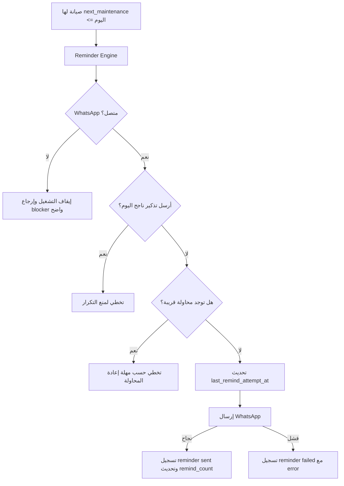

# معمارية التذكيرات والإرسال

## الهدف

مسار التذكيرات يجب أن يكون واضحا وقابلا للتشخيص:

1. لا ترسل رسالة إذا كان واتساب غير متصل.
2. لا تكرر رسالة ناجحة لنفس الصيانة في نفس اليوم.
3. لا تكرر محاولات فاشلة بسرعة عند وجود رقم خاطئ أو مشكلة واتساب.
4. تسجل كل محاولة إرسال فعلية في `reminders` بحالة واضحة.
5. تعرض الواجهة سبب التوقف قبل أن يضغط المستخدم إرسال.

## المكونات

- `server/reminderEngine.ts`
  - يفحص الصيانات المستحقة.
  - يفحص حالة واتساب قبل بدء الإرسال.
  - يدير مهلة إعادة المحاولة.
  - يرسل عبر `whatsappService`.
  - يسجل `sent` أو `failed`.
  - يحفظ آخر تشغيل للجدولة.

- `server/whatsapp.ts`
  - يدير جلسة WhatsApp Web.
  - يولد QR حقيقي.
  - يحفظ الجلسة في `.wa-session/`.
  - يمنع حالات اتصال عالقة عند الضغط المتكرر.

- `server.ts`
  - يعرّف API:
    - `GET /api/reminders/diagnostics`
    - `GET /api/reminders/scheduler`
    - `POST /api/reminders/run-due`
    - `POST /api/installations/:id/remind`
  - يشغل `node-cron` عندما تكون `ENABLE_DAILY_CRON=true`.

- `src/api.ts`
  - يربط الواجهة بالـ API.
  - في الوضع المحلي يستخدم localStorage، لكن الفحص التلقائي المحلي يعمل من المتصفح فقط.

- `src/App.tsx`
  - يعرض تشخيص التذكيرات في تبويب واتساب.
  - يوضح إن كان السبب واتساب، عدم وجود مستحقات، أو مهلة إعادة محاولة.

## رحلة العمل

## الحقول المهمة

- `installations.last_remind_at`: آخر إرسال ناجح.
- `installations.last_remind_attempt_at`: آخر محاولة إرسال، ناجحة أو فاشلة.
- `installations.next_remind_type`: نوع التذكير التالي.
- `installations.remind_count`: عدد الرسائل الناجحة.
- `reminders.status`: `sent` أو `failed`.
- `reminders.error`: سبب الفشل، إن وجد.
- `reminders.trigger`: `manual` أو `automatic` أو `scheduled`.

## الفرق بين المحلي والسحابي

- عند استخدام Firebase/Firestore: الجدولة تعمل من السيرفر وتستمر حتى لو المتصفح مغلق.
- عند استخدام Local Auth/localStorage: البيانات موجودة في المتصفح، لذلك الفحص التلقائي يعمل أثناء فتح المتصفح فقط.
- لنشر دائم وموثوق للتذكيرات استخدم Firestore مع VPS أو سيرفر دائم لواتساب.
