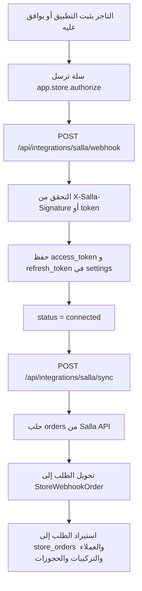

# معمارية ربط سلة عبر Easy Mode و API Sync

المسار الرسمي الحالي لربط سلة في Golden Pro CRM هو:

1. **Salla Easy Mode** للحصول على `access_token` و`refresh_token`
2. **Salla API Sync** لجلب الطلبات من `admin/v2/orders`
3. **Store Webhook** يبقى قناة مساعدة لتشخيص الأحداث أو استقبال طلبات فورية عند الحاجة

## لماذا اعتمدنا Easy Mode

- التطبيقات المنشورة على Salla App Store تعمل فعليًا عبر Easy Mode.
- سلة ترسل حدث `app.store.authorize` إلى Webhook التطبيق بعد موافقة التاجر.
- هذا المسار لا يعتمد على `code` في callback مثل Custom OAuth.
- لذلك هو الأنسب لحالة التطبيق المنشور لديك.

## المسارات المستخدمة

- `GET /api/integrations/salla/status`
- `POST /api/integrations/salla/webhook`
- `POST /api/integrations/salla/sync`
- `GET /api/integrations/salla/callback` يبقى موجودًا فقط للتوافق والاختبار، وليس المسار الأساسي في Easy Mode

## متغيرات البيئة

```env
SALLA_AUTH_MODE=easy
SALLA_CLIENT_ID=
SALLA_CLIENT_SECRET=
SALLA_SCOPES=offline_access orders.read products.read customers.read
SALLA_SYNC_CRON_ENABLED=true
SALLA_SYNC_CRON_SCHEDULE=*/15 * * * *
SALLA_SYNC_MAX_PAGES=3
SALLA_SYNC_PAGE_SIZE=30
SALLA_CUSTOMER_SYNC_MAX_PAGES=200
SALLA_CUSTOMER_SYNC_PAGE_SIZE=60
SALLA_CUSTOMER_SYNC_INTERVAL_MINUTES=360
SALLA_APP_WEBHOOK_SECRET=
SALLA_APP_OWNER_UID=
```

إعدادا `SALLA_SYNC_MAX_PAGES` و`SALLA_SYNC_PAGE_SIZE` خاصان بالطلبات والمنتجات. مزامنة العملاء مستقلة بحجم 60 سجلًا وحتى 200 صفحة، أي سعة 12000 عميل في التشغيل الكامل. الزر اليدوي ينفذ التشغيل الكامل دائمًا، بينما يتجاوز المجدول مزامنة العملاء المكتملة حديثًا حتى تمر مدة `SALLA_CUSTOMER_SYNC_INTERVAL_MINUTES`؛ والمزامنة الناقصة يعاد تشغيلها في دورة المجدول التالية.

يمكن استخدام:

- `SALLA_APP_WEBHOOK_SECRET`
- أو fallback إلى `STORE_WEBHOOK_SECRET`

ويمكن استخدام:

- `SALLA_APP_OWNER_UID`
- أو fallback إلى `STORE_WEBHOOK_OWNER_UID`

## الرحلة الكاملة



## مثال Payload من سلة

بحسب توثيق Salla App Events، يصل حدث `app.store.authorize` بصيغة مشابهة لهذا:

```json
{
  "event": "app.store.authorize",
  "merchant": 1234509876,
  "created_at": "2022-12-31 12:31:25",
  "data": {
    "access_token": "token",
    "expires": 1634819484,
    "refresh_token": "refresh",
    "scope": "settings.read branches.read offline_access",
    "token_type": "bearer"
  }
}
```

المصدر:
- [App Events - Salla Docs](https://docs.salla.dev/421413m0)
- [Authorization - Salla Docs](https://docs.salla.dev/421118m0)

## أين نحفظ بيانات سلة

حاليًا تحفظ داخل `settings/{uid}` بالحقول:

- `salla_provider`
- `salla_status`
- `salla_auth_mode`
- `salla_access_token`
- `salla_refresh_token`
- `salla_expires_at`
- `salla_scope`
- `salla_token_type`
- `salla_merchant_id`
- `salla_store_name`
- `salla_store_url`
- `salla_last_authorized_at`
- `salla_last_event_at`
- `salla_last_event_type`
- `salla_last_sync_at`
- `salla_last_sync_status`
- `salla_last_sync_count`
- `salla_last_sync_error`
- `salla_last_customer_sync_at`
- `salla_last_customer_sync_status`
- `salla_last_customer_sync_count`
- `salla_last_customer_sync_error`
- `salla_last_customer_sync_complete`
- `salla_last_remote_update_at`

## كيف نتحقق من Webhook التطبيق

يفضل في Salla Partners اختيار:

- **Signature**

ويتحقق الخادم من:

- `X-Salla-Signature`

باستخدام `SALLA_APP_WEBHOOK_SECRET`.

كما يقبل المشروع أيضًا التحقق بأسلوب secret/token للاختبارات اليدوية.

## دور زر "بدء ربط سلة"

في `SALLA_AUTH_MODE=easy` لا يستخدم هذا الزر، لأن الربط لا يعتمد على callback code.

بدل ذلك:

1. ضع `Webhook URL` الظاهر في الإعدادات داخل Salla Partners
2. احفظ السر
3. ثبّت التطبيق أو وافق عليه
4. انتظر وصول `app.store.authorize`
5. حدّث الحالة داخل الإعدادات
6. اضغط `مزامنة الآن`

إذا أردت اختبار Custom Mode فقط، غيّر:

```env
SALLA_AUTH_MODE=custom
```

لكن هذا ليس المسار الموصى به للتطبيق المنشور.

## كيف تدخل الطلبات للنظام

المزامنة من API لا تنشئ منطقًا موازيًا جديدًا. بل:

1. `server/salla.ts` يجلب الطلبات من Salla API
2. يحول كل طلب إلى `StoreWebhookOrder`
3. يمرره إلى `importStoreOrderForUser`
4. نفس محرك الرحلة في `server/storeWebhook.ts` يقرر:
   - `sale_only`
   - `install_maintenance`
   - `maintenance_existing`
   - `external_maintenance`
   - `needs_review`

وبهذا تبقى الرحلة موحدة سواء جاء الطلب من:

- Salla API Sync
- Store Webhook
- إدخال يدوي

## الاختبار اليدوي الصحيح الآن

1. ضع `SALLA_CLIENT_ID` و`SALLA_CLIENT_SECRET`
2. ضع `SALLA_APP_WEBHOOK_SECRET`
3. ضع `SALLA_APP_OWNER_UID`
4. شغّل السيرفر
5. افتح `الإعدادات > ربط سلة عبر API`
6. انسخ `Webhook URL`
7. ضعه في Salla Partners داخل `رابط استقبال التنبيهات`
8. اختر `Signature`
9. اجعل السر في سلة هو نفس `SALLA_APP_WEBHOOK_SECRET`
10. ثبّت التطبيق على المتجر أو وافق عليه
11. حدّث الحالة داخل النظام
12. اضغط `مزامنة الآن`
13. افتح `طلبات المتجر`
