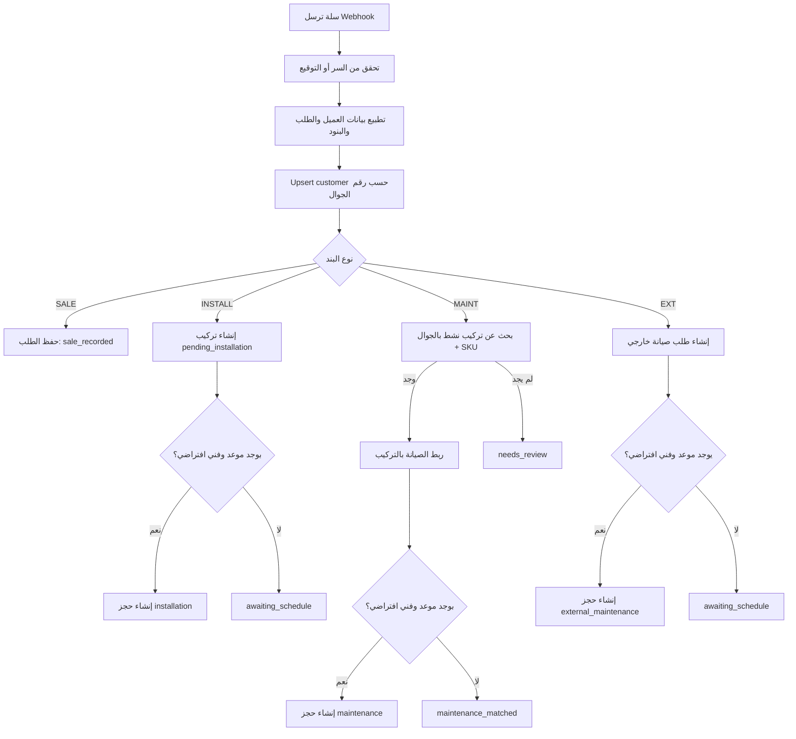

# معمارية ربط سلة عبر Webhook

## الهدف

استقبال طلبات سلة وتحويلها إلى رحلة واضحة داخل Golden Pro CRM:

- العميل يأتي من مصدرين: إدخال يدوي أو سلة.
- طلب سلة قد يكون بيع فقط، تركيب وصيانة، أو صيانة لمنتج سابق.
- التذكيرات تبدأ فقط من التركيبات النشطة، ولا تبدأ من طلب بيع عادي.
- حجز الفني ينشأ تلقائيا فقط عند وصول موعد من سلة مع ضبط فني افتراضي.

## نقطة الاستقبال

```text
POST /api/store/webhook
```

المسار عام لأن سلة هي التي تستدعيه، لذلك الحماية تكون بإحدى طريقتين:

- `X-Golden-Webhook-Secret` بنفس قيمة `STORE_WEBHOOK_SECRET`.
- `X-Golden-Signature: sha256=<hex>` أو `X-Salla-Signature` بتوقيع HMAC SHA-256 لجسم الطلب.

المتغيرات المطلوبة:

```env
STORE_WEBHOOK_SECRET=
STORE_WEBHOOK_OWNER_UID=
STORE_WEBHOOK_DEFAULT_MAINTENANCE_MONTHS=3
STORE_WEBHOOK_CREATE_BOOKINGS=true
STORE_WEBHOOK_DEFAULT_TECHNICIAN_ID=
STORE_WEBHOOK_DEFAULT_TECHNICIAN_NAME=
```

## تصنيف بنود سلة

يعتمد النظام على SKU أو وسم المنتج:

- `SALE-` أو `sale_only`: بيع فقط، يحفظ الطلب ولا ينشئ تركيبا أو حجزا.
- `INSTALL-` أو `install_maintenance`: منتج جديد يحتاج تركيبا وصيانة.
- `MAINT-` أو `maintenance_existing`: طلب صيانة لمنتج سابق.
- `EXT-` أو `external_maintenance`: طلب صيانة لجهاز ليس من Golden Pro؛ ينشئ أصل خدمة قابل للجدولة بدون البحث عن تركيب سابق.
- أي بند غير مصنف يدخل `needs_review` ولا ينشئ تركيبا خاطئا.

## رحلة الطلب



## قواعد الإكمال

- إكمال حجز `installation` يحول التركيب إلى `active` ويحسب `next_maintenance`.
- إكمال حجز `maintenance` يحدث نفس التركيب القديم ولا ينشئ تركيبا مكررا.
- عند الإكمال يعاد ضبط `remind_count = 0` و`next_remind_type = first`.

## مجموعات Firestore المستخدمة

- `customers`: العميل مع `source = manual | salla`.
- `products`: المنتج مع `product_type` عند قدومه من سلة.
- `installations`: التركيبات، وقد تبدأ كـ `pending_installation`.
- `bookings`: حجوزات التركيب أو الصيانة مع `booking_type`.
- `store_orders`: رحلة الطلب الحالية والبنود المصنفة.
- `store_webhook_events`: منع التكرار وسجل استقبال الويب هوك.

## واجهات API

- `GET /api/store/orders`: عرض طلبات المتجر.
- `GET /api/store/orders/:id`: تفاصيل طلب.
- `POST /api/store/orders/:id/link-installation`: ربط طلب صيانة يحتاج مراجعة بتركيب سابق.
- `POST /api/bookings/:id/complete`: إكمال حجز وتحديث دورة الصيانة.

عند الربط اليدوي لطلب صيانة يحتاج مراجعة، إذا كان الطلب يحتوي موعدا وكان الفني الافتراضي مضبوطا، ينشئ النظام حجز صيانة تلقائيا بدلا من تركه مرتبطا فقط.

## رعاية العملاء

الهدف التشغيلي للنظام هو ألا يبقى أي عميل بلا متابعة. لذلك تعرض صفحة "رعاية العملاء" العملاء الذين:

- لا يملكون أي نشاط أو تذكير بعد إضافتهم.
- لديهم صيانة مستحقة أو متأخرة.
- لديهم تركيب نشط ولم يرسل لهم أي تذكير.

طلبات `EXT-` تدخل نفس دورة الرعاية بعد إكمال الحجز، حتى لو كان الجهاز ليس مبيعا من Golden Pro.

## مثال Payload

```json
{
  "event": "order.created",
  "provider": "salla",
  "order": {
    "id": "10025",
    "number": "10025",
    "status": "paid",
    "created_at": "2026-04-26T10:30:00Z",
    "customer": {
      "name": "عميل المتجر",
      "phone": "0555555555",
      "city": "الرياض"
    },
    "items": [
      {
        "name": "فلتر ذهبي",
        "sku": "INSTALL-GP-FILTER",
        "quantity": 1,
        "maintenance_months": 3
      },
      {
        "name": "زيارة صيانة فلتر",
        "sku": "MAINT-GP-FILTER",
        "quantity": 1
      }
    ],
    "installation_date": "2026-04-28",
    "installation_time": "10:00"
  }
}
```

## إعدادات سلة المقترحة

- اسم الحدث: `Golden Pro CRM - طلب جديد`.
- نوع الحدث: `order.created` أو `invoice.created` حسب مرحلة الطلب التي تريد الاعتماد عليها.
- إصدار Webhook: `v2`.
- رابط الحدث: `https://YOUR_DOMAIN/api/store/webhook`.
- Request headers:
  - `X-Golden-Webhook-Secret`: نفس قيمة `STORE_WEBHOOK_SECRET`.
