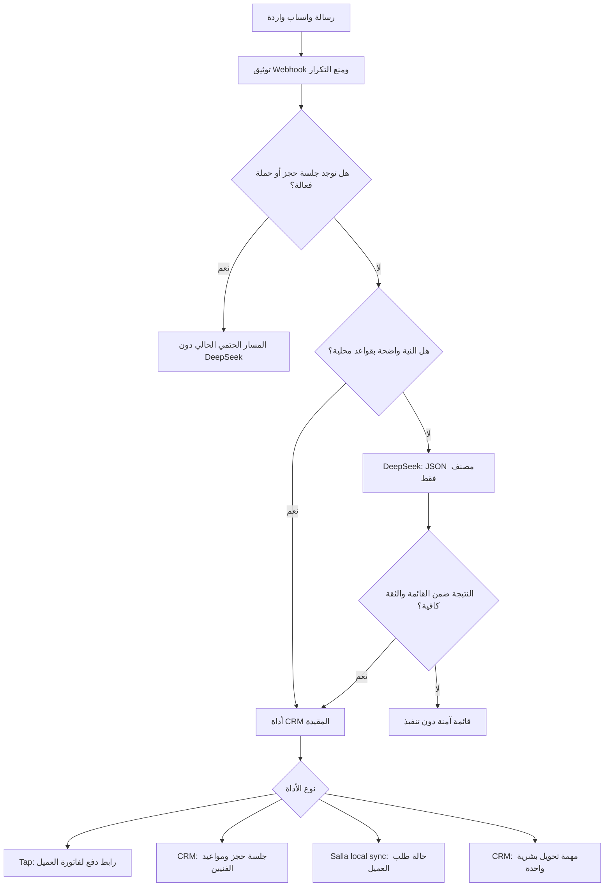

# معمارية مساعد واتساب الذكي عبر DeepSeek

الإصدار: `1.9.5`

## الهدف

يفهم المساعد رسالة العميل العربية الحرة ثم يختار مسارًا واحدًا فقط:

1. إنشاء رابط دفع لفاتورة صادرة وغير مدفوعة مرتبطة برقم العميل.
2. بدء حجز تركيب أو صيانة داخل جلسة CRM المقيدة.
3. إظهار آخر حالة طلب متزامنة من سلة للعميل نفسه.
4. إنشاء مهمة CRM عاجلة لتحويل المحادثة إلى موظف.
5. عرض القائمة الآمنة إذا كانت الرسالة غامضة أو فشل مزود الذكاء الاصطناعي.

DeepSeek لا ينشئ روابط دفع، ولا يحجز موعدًا، ولا يقرأ قاعدة البيانات، ولا ينفذ
أوامر CRM. دوره مصنف نية فقط.

## تدفق العمل



## حدود البيانات المرسلة إلى DeepSeek

- يرسل نص رسالة العميل فقط بعد تقليص المسافات وبحد أقصى `500` محرف.
- لا يرسل رقم الجوال أو اسم العميل أو معرف المالك أو الفاتورة أو الطلب.
- لا يخزن نص الرسالة في سجل تدقيق الذكاء الاصطناعي.
- يسجل فقط بصمات `SHA-256`، النية، الثقة، النموذج، حالة المحاولة، ورمز الخطأ.
- مدة سجل التدقيق `30` يومًا.

## العقد بين DeepSeek والـCRM

النتيجة المقبولة هي JSON بالمفاتيح التالية فقط:

```json
{
  "intent": "payment_link | booking | order_status | human_handoff | menu | unknown",
  "confidence": 0.0,
  "order_number": null,
  "department": "sales | support | maintenance | null"
}
```

- أي نية غير معروفة تتحول إلى `unknown`.
- أي ثقة أقل من `0.72` تتحول إلى `unknown`.
- رقم الطلب يقبل أحرفًا وأرقامًا و`-` و`_` فقط وبحد أقصى `60` محرفًا.
- أي حقول إضافية مثل رابط دفع أو اسم أداة أو أمر حذف تُهمل.
- المهلة الافتراضية `8` ثوانٍ، وبعدها تظهر القائمة الآمنة.
- الحد الافتراضي `20` طلب تصنيف لكل رقم في الساعة.

## صلاحيات الأدوات

### رابط الدفع

يستدعي المسار الحالي الخاص بـTap. يبحث عن أحدث فاتورة صادرة وغير مدفوعة
بـ`owner_uid` ورقم جوال المرسل، ويستخدم مفتاح idempotency ثابتًا. لا يعتمد الرابط
الذي يعيده DeepSeek لأن النموذج لا يملك حق إرجاع رابط أصلًا.

### الحجز

يبدأ جلسة الحجز الحالية. بمجرد بدء إدخال الاسم أو العنوان أو اختيار الجهاز أو
الموعد، لا يستدعى DeepSeek داخل الجلسة. المواعيد والتعارض والسعة واختيار الفني
تبقى منطق CRM الحالي.

### حالة الطلب

يقرأ `store_orders` محليًا باستخدام:

- `owner_uid` الحالي.
- آخر أرقام من جوال مرسل واتساب.
- رقم الطلب نفسه عند كتابته.
- استبعاد الطلبات المحذوفة.

لا يمكن لرقم طلب صحيح وحده تجاوز شرط الجوال والمالك. الرد يوضح أن الحالة هي من
آخر مزامنة مع المتجر.

### التحويل إلى موظف

ينشئ مهمة `crm_tasks` بأولوية عالية، ويربطها بالعميل إن كان معروفًا. يحاول اختيار
موظف نشط من قسم المبيعات أو الصيانة أو خدمة العملاء، وإلا تبقى المهمة في طابور
خدمة العملاء. يتكرر نفس المعرف خلال نافذة `30` دقيقة لمنع ازدواج المهمة.

## متغيرات البيئة

```dotenv
WHATSAPP_COMMERCE_ENABLED=true
WHATSAPP_AI_ENABLED=true
DEEPSEEK_API_KEY=ضع_المفتاح_الجديد_هنا_داخل_الخادم_فقط
DEEPSEEK_BASE_URL=https://api.deepseek.com
DEEPSEEK_MODEL=deepseek-v4-flash
WHATSAPP_AI_TIMEOUT_MS=8000
WHATSAPP_AI_MAX_REQUESTS_PER_PHONE_HOUR=20
WHATSAPP_AI_CONFIDENCE_THRESHOLD=0.72
WHATSAPP_AI_VERIFICATION_MAX_AGE_HOURS=24
```

لا تضع المفتاح في Git أو الدردشة أو صورة. إذا ظهر مفتاح في أي منها، ألغِه من
لوحة DeepSeek وأنشئ بديلًا قبل الاختبار.

## تفعيل آمن

1. ألغِ المفتاح المكشوف وأنشئ مفتاحًا جديدًا.
2. افتح ملف بيئة الإنتاج على الخادم مباشرة.
3. أضف `DEEPSEEK_API_KEY` واضبط `WHATSAPP_AI_ENABLED=true`.
4. أعد تشغيل خدمة CRM.
5. افتح وحدة تحكم واتساب وتأكد أن البطاقة تعرض:
   - التفعيل: مفعّل.
   - المفتاح: موجود في بيئة الخادم.
   - الحالة قبل أول Canary: مهيأ — بانتظار تحقق حي.
6. نفذ Canary من رقم اختبار مسموح بهذه الرسائل:
   - «أرسل لي الشيء اللي أقدر أكمل الحساب منه».
   - «أبغى أرتب زيارة للفني الأسبوع الجاي».
   - «خبرني وين وصلت الشغلة اللي طلبتها».
   - «ودي أحد من المبيعات يتابع معي».
7. تحقق أن رابط الدفع مصدره Tap، والحجز داخل CRM، والطلب يعود لنفس الرقم، ومهمة
   التحويل ظهرت مرة واحدة.
8. حدّث وحدة تحكم واتساب وتأكد أن الحالة أصبحت «جاهز وتم التحقق من اتصال
   DeepSeek». يعتمد الإثبات على استجابة ناجحة حديثة وبصمة المفتاح والنموذج
   الحاليين، ولا يعتمد على مجرد وجود المتغير.

## التحقق والرجوع

اختبارات الميزة:

```powershell
node --import tsx --test server/whatsappAi.test.ts server/whatsappCommerce.test.ts
```

إيقاف فهم الرسائل الحرة دون تعطيل بقية واتساب:

```dotenv
WHATSAPP_AI_ENABLED=false
```

إيقاف الدفع والحجز والمساعد مع إبقاء مسار واتساب العام:

```dotenv
WHATSAPP_COMMERCE_ENABLED=false
```

المسار الحالي لوظائف الدفع والحجز يعتمد مخزن SQLite. إذا كانت بيئة بعينها تستخدم
مزود بيانات آخر، تعرض نتيجة `unsupported_store` ولا يجوز اعتبار المساعد مفعّلًا
حتى توحيد مستودع هذه العمليات أو تشغيلها على SQLite.

## مراجع DeepSeek الرسمية

- [Function Calling](https://api-docs.deepseek.com/guides/function_calling/)
- [Tool Calls](https://api-docs.deepseek.com/guides/tool_calls)
- [JSON Output](https://api-docs.deepseek.com/guides/json_mode/)

## سجل النشر — 2026-07-29

- نُشر الإصدار `1.9.5` إلى `https://crm.breexe-pro.com` بالبناء
  `8f7d24e6c021`.
- أنشأت معاملة النشر نسخة احتياطية، وحافظت على ملف بيئة الخادم، وتحققت من
  صحة CRM وواجهة Odoo قبل اعتماد الإصدار.
- أعاد فحص مستقل بعد النشر `status=ok` و`runtime=production` والحاوية
  `healthy`.
- بقي التشغيل في وضع الأمان: مزود واتساب `web`، والإرسال `allowlist`،
  و`OFFICIAL_LAUNCH_APPROVED=false`، و`WHATSAPP_COMMERCE_ENABLED=false`،
  و`WHATSAPP_AI_ENABLED` غير مفعّل.
- لم يُستخدم المفتاح الظاهر في صورة أو دردشة ولم تُنفذ تجربة DeepSeek حية.
  يلزم إلغاء المفتاح المكشوف، ووضع بديل جديد مباشرة على الخادم، ثم تنفيذ
  Canary من رقم مسموح قبل اعتبار الاتصال جاهزاً.
